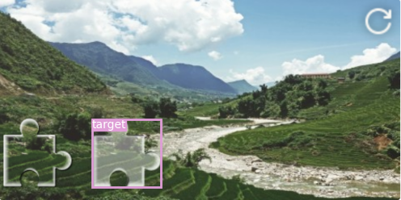

# PyTorch-YOLOv4

Minimal PyTorch implementation of YOLOv4,out-of-the-box,training,testing&detect your custom objects  
fork from [https://github.com/eriklindernoren/PyTorch-YOLOv3](https://github.com/eriklindernoren/PyTorch-YOLOv3) & [https://github.com/Python3WebSpider/DeepLearningSlideCaptcha](https://github.com/Python3WebSpider/DeepLearningSlideCaptcha)

[简体中文](./README-zh.md)
## Clone PyTorch-YOLOv4

### Clone and install requirements

```
git clone https://github.com.cnpmjs.org/SOVLOOKUP/PyTorch-YOLOv4
cd PyTorch-YOLOv4/
sudo pip3 install -r requirements.txt
```


### Download pretrained weights

```
$ cd weights/                                # Navigate to data dir
$ bash download_weights.sh              # Will download coco dataset
``` 

### Download COCO

*it is not necessary*  
I use an another dataset to test yolov4 but if you want test it on coco you can download it.
```
$ cd data/                                # Navigate to data dir
$ bash get_coco_dataset.sh                # Will download coco dataset
```

## Prepare data

Use LabelImg to mark your datas in browser.

LabelImg：[https://github.com/tzutalin/labelImg](https://github.com/tzutalin/labelImg)

Or you can use Yolomark.

Yolomark: [https://github.com/AlexeyAB/Yolo_mark](https://github.com/AlexeyAB/Yolo_mark)

## Train

Slider verification data set has been prepared in `<data/captcha>`.

training command：

```
python3 train.py --model_def config/yolov4-captcha.cfg --data_config config/captcha.data --pretrained_weights weights/pre/yolov4.conv.137

```


### Tensorboard
Track training progress in Tensorboard:
* Initialize training
* Run the command below
* Go to http://localhost:6006/

```
$ tensorboard --logdir='logs' --port=6006
```

## Test

After the training, the PTH file will be generated in the `<checkpoints>` folder, and the model can be directly used to predict the results.

testing command：

```
python3 detect.py --model_def config/yolov4-captcha.cfg --weights_path checkpoints/yolov4_ckpt.pth --image_folder data/captcha/test --class_path data/captcha/classes.names

```

The script will read all the pictures under `<data/captcha/test>`, and output the processed results to the `<data/captcha/result>` folder.

OutPut：

```
Performing object detection:
        + Batch 0, Inference Time: 0:00:00.044223
        + Batch 1, Inference Time: 0:00:00.028566
        + Batch 2, Inference Time: 0:00:00.029764
        + Batch 3, Inference Time: 0:00:00.032430
        + Batch 4, Inference Time: 0:00:00.033373
        + Batch 5, Inference Time: 0:00:00.027861
        + Batch 6, Inference Time: 0:00:00.031444
        + Batch 7, Inference Time: 0:00:00.032110
        + Batch 8, Inference Time: 0:00:00.029131

Saving images:
(0) Image: 'data/captcha/test/captcha_4497.png'
        + Label: target, Conf: 0.99999
(1) Image: 'data/captcha/test/captcha_4498.png'
        + Label: target, Conf: 0.99999
(2) Image: 'data/captcha/test/captcha_4499.png'
        + Label: target, Conf: 0.99997
(3) Image: 'data/captcha/test/captcha_4500.png'
        + Label: target, Conf: 0.99999
(4) Image: 'data/captcha/test/captcha_4501.png'
        + Label: target, Conf: 0.99997
(5) Image: 'data/captcha/test/captcha_4502.png'
        + Label: target, Conf: 0.99999
(6) Image: 'data/captcha/test/captcha_4503.png'
        + Label: target, Conf: 0.99997
(7) Image: 'data/captcha/test/captcha_4504.png'
        + Label: target, Conf: 0.99998
(8) Image: 'data/captcha/test/captcha_4505.png'
        + Label: target, Conf: 0.99998
```

Results：





## Train and detect your custom objects

1. format your data：[https://github.com/eriklindernoren/PyTorch-YOLOv3#train-on-custom-dataset](https://github.com/eriklindernoren/PyTorch-YOLOv3#train-on-custom-dataset)。

2. create your model-config:

replace `<num-classes>` with your num-classes

```
$ cd config/                                # Navigate to config dir
$ bash create_custom_model.sh <num-classes> # Will create custom model 'yolov4-custom.cfg'
```

3. train it
training command：
```
python3 train.py --model_def config/yolov4-custom.cfg --data_config config/{YourSetName}.data --pretrained_weights weights/pre/yolov4.conv.137

```

## 协议

本项目基于开源 [GNU 协议](https://github.com/eriklindernoren/PyTorch-YOLOv3/blob/master/LICENSE)，另外本项目不提供任何有关滑动轨迹相关模拟和 JavaScript 逆向分析方案。

本项目仅供学习交流使用，请勿用于非法用途，本人不承担任何法律责任。

如有侵权请联系个人删除，谢谢。

@article{yolov4,  
  title={YOLOv4: YOLOv4: Optimal Speed and Accuracy of Object Detection},  
  author={Alexey Bochkovskiy, Chien-Yao Wang, Hong-Yuan Mark Liao},  
  journal = {arXiv},  
  year={2020}  
}
